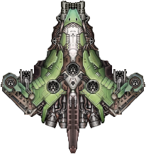
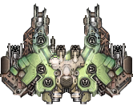
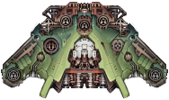
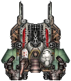
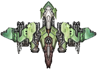

# Nights of Lewdd

## Ships

### Capitals

#### Vengeance-class early midline prototype

The Vengeance-class cruiser was an early midline prototype developed pre-Collapse. It was deemed a failure and abandoned by Domain captains, but not before its highly unstable Vengeance Core claimed the lives of thousands both on and off the battlefield. On paper, the ship was expected to be a solid winner; start with a reliable, low-tech base, trade some hull and armor for agility, and then develop and build in a missile reflection system. In practice, however, every use of the Vengeance Core carried a chance of catastrophic breakdown.

After the Collapse, Iron Shell engineers picked up and corrected many of the design flaws. The namesake system, affectionately called the 'no-u' by its crew, reliably sends missiles caught by its pulse right back to the enemy. A 'dry fire', one engineer explains gravely, is not advised.

#### Lunaria-class artillery hackjob

artillery boat hackjob made from destroyed or otherwise totaled onslaughts

- LIDAR array for system (only affects large turrets)
- 1 large missile
- 2x large ballistics
- plus some smalls and meds for frontal firepower
- 6 armor modules (4 of which have builtin range boosted vulcans). Lastly
- 2x builtin DEM/TPC precurors
- long range dumbfire HE TPC beams that have zero tracking

Hulls are rarely ever truly lost in the sector. "Today's wreck is tomorrow's Hound" is an old mechanic saying, and the Lunaria-class artillery capital ship is the concept taken to its conclusion; a ship designed from the start to be built from the salvage of unfortunate Onslaughts. The iconic forward prongs chew through targets after being softened by heavy long-range batteries boosted by the terrifying LIDAR Array. Six slabs of armor protect it in close combat, but, like its progenitors, a meager two aft weapons leave it vulnerable to attack from behind.

### Cruisers

#### Larkspur-class high-end cruiser

- has a canister flak omni-lunge system
- great frontal firepower and all round stats
- expensive compared to typical cruisers

Marveling at the cleanly-engineered systems and the surprising agility of the Larkspur-class cruiser is looked upon with studied disapproval, but, in private, even Knights are said to revel in the "high-end" tech it carries. As with most of the hulls birthed by Ceyx, its fury is directed forward, but flanking frigates would do well to tread carefully. The Omni-Lunge Canister Flak system has chastened many would-be opportunists.

#### Lotus-class missile cruiser

- 3 med ballistics for backup firepower
- it has 4x small milotus has 4x small missiles 1x large
- system is a laser beam that debuffs target to take more energy/ballistic dmg
- so the ship is sorta supporty but also has great ballistic firepower compared to Gryphon
- i was thinking of giving it a small missile forge with limited charges as a subsystem as well

The Knights' heavy support cruiser lurks behind the front lines, waiting for a target. Once a suitable foe wanders within range, it paints them with its laser array and pounds them with a rain of missiles.

### Destroyers

#### Marigold-class missile destroyer

- no idea what system
- lotsa small missiles and ballistics
- 2 med missiles

The Marigold is the Knights of Ludd's tempered answer to the Manticore. Cheaper to field and more flexible to outfit, it nonetheless lacks the firepower afforded by large ballistic weaponry. When faced with detractors, most Knights are quick to point out that the original Manticore is merely a Domain tool of war, and not a design worthy of the faithful's respect.

#### Mimosa-class shieldless arty boat

- has LIDAR
- tons of smalls + a med hardpoint.
- Canister Flak defensive system
- good frontal module coverage

A Mimosa provides effective support for a balanced fleet by painting opportune enemies with its LIDAR Array, shredding fighters with canister flak, and, if needed, absorbing stray fire with its armor modules. Never the hero of a battle, the Mimosa-class is nevertheless sorely missed by Knights forced to go without.

### Frigates

#### Sundew-class better mudskipper

- mudskipper with armor modules and an omni-lunge system
- better stats
- 2 extra small mounts

To confuse a Mudskipper and a Sundew is to confuse a Luddic with a Pather - or, indeed, a Knight. Thought there are similarities, the Sundew is a fierce, shielded, armored, and highly mobile ship capable of quickly dusting any captains not taking it seriously.

#### Protea-class high-end frigate

- (like tempest)
- has 2x 2-wing drone wings + Termination sequence
- two armor module drones with long respawn times
- pilots tend to yeet the armor drones when they are close to death, and use the ships shields to cover for their defensive weakness as the armor drones are reforged

In a marked departure from standard doctrine, the Protea-class frigate eschews cumbersome armor modules in favor of armored drones, giving it the freedom to choose when and where to thrust its oversize ballistic weaponry.

## Weapons

### Large Weapons

#### Caelia

A variant of the Hephaestus assault gun given a larger bore size by luddic engineers and loaded with explosive shells. While undoubtedly effective, the incredible heat generated during fire easily deforms the cannon's more delicate components, and sustained salvoes readily devolve into undirected fire.

#### Llyr
A variant of the Caelia assault gun modified to fire depleted uranium kinetic penetrators. Excellent at bringing down enemy shields and causing an overload. While certainly effective, the incredible heat generated during fire easily deforms the cannon's more delicate components, and sustained salvoes readily devolve into undirected fire.

#### Lunete

- builtin dumbfire HE TPC DEM for the Lunaria

A powerful energy torpedo that generates a lance of plasma though the controlled detonation of a nitrogen medium.  First designed for Onslaught battleships operating far from core Domain space, where the complex parts required to maintain thermal pulse cannons could not be readily supplied. 

### Small Weapons

#### Tor

A lower caliber and less demanding version of the Mauler cannon, firing antimatter charged munitions that are highly effective at destroying enemy armor. Manufactoring such an advanced weapon system is beyond the normal means of the Church, and most of these are traded by the Hegemony as part armament transfer treaties that date back to the First AI War.

## Skills

### Phase transposition (Luna Sea)
Synchronize the fleets drive bubble with subtle fluctuations in ambient phase space, allowing near instantaneous displacement to the "Luna Sea" star system.

A successful transposition creates persistent deformations within the target system's phase space, preventing repeat transpositions for a period of three months. The safety and-long term effects of this manuever, both on crew and stellar objects, are completely unknown. 

## Hullmods 
### KOL MODIFICATIONS

Unable or unwilling to service the complex powerplants and ship nanoforges that allow the deployment of modern shield and ablative armor systems, the defensive strategy of the Knights of Ludd necesarilly centers around much simpler disposable external armor plates backed up by older capacitor-based shield screens. While such doctrine can be effective when ships are deployed in large numbers, it is decidedly less so when ships are forced to operate alone or in small groups.

Although any ship that loses its external armor plates is effectively crippled, the accompanying mass reduction will at least allow it to perform a rapid retreat.